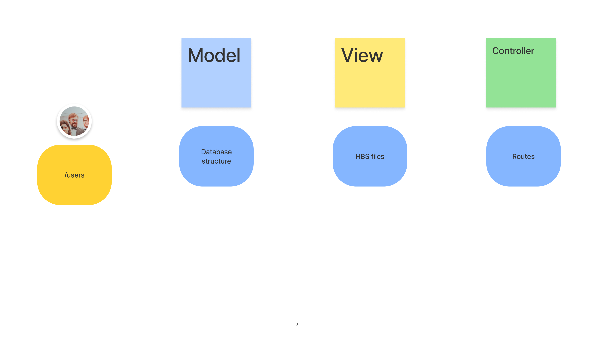

# Reinforcment Back-end.

> Note that the reinforcment are not mandatory, they are given live and some of the material is best followed when participating. This is not a course reimplacment :)

## **Review of the MVC**

---

### What do you need to build in your server in order to receive requests at the `/users` endoint ?

---

> ### Controller

- Create a route that will listen for a request at `/users`.

  - Is the route prefixed or not ? You decide !

  - Build the logic in the route:

    - Does it need to access some informations in the payload ?
    - Does it need to request something from the DB
    - Will it redirect to another endoint or render a page ?
    - If rendering, what page should it render and should the view have access to some variables ?

> ### View

- Create the `*.hbs` file which will be rendered by some route.

  - Does it need any hbs logic ? Loops ? Conditional rendering (if/else)
  - What are the name of the variables provided by the route ?
  - When placing links (`<a href="/some/endpoint">Go somewhere</a>`) to what endpoint should they go ?

    - If the route is already created, the endpoint should be the same path.

    - If the route is not already created, note that you'll need to use the same endpoint when creating it.

> ### Model

- Check that your model is consistent with the data you're trying to display on the view.
- Do you even gave some data in your database ?

---

> **You can do those steps in any order. The keypoint is to be consistent.**

---

## **How to read a server?**

When opening a new project that already has some code you did not wrote, you might feel overwhelmed by all the different files there is and where to start.

**No panic !**

- open the `package.json` file.
- Fine out what the `dev` or `start` script is launching.
  > **HINT:** If there is no file specified, it's probably `index.js`
- Go to that file and follow the flow.

  - How to follow the flow ?
  - Whenever you see a require that is not a file coming from `node_modules`, open the file, read through it.
  - When you've finished reading through a file, go back to the file that required it and keep reading through. You will see every single files in your server the way JavaScript read through them.
